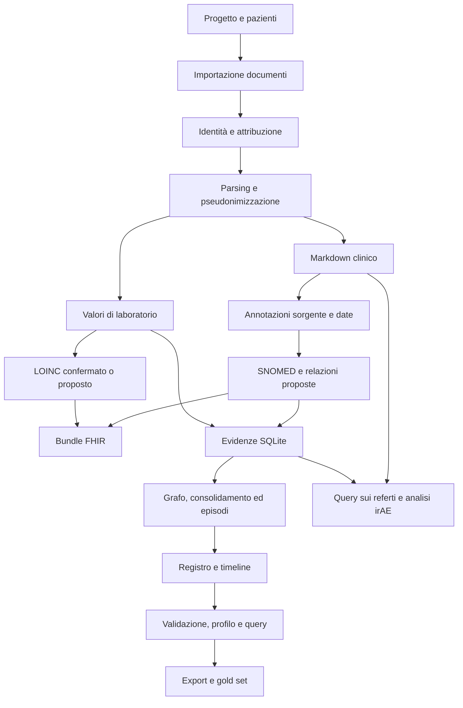

# EMR Analyzer — analisi del codice e report tecnico

**Data:** 1 ottobre 2026. **Versione dichiarata:** 0.7.0. **Schema SQLite:** 21.

## 1. Esito della revisione

L'applicazione implementa un insieme ampio di strumenti locali per importare documentazione sanitaria, pseudonimizzarla, estrarre risultati di laboratorio ed eventi clinici, consultarli e revisionarli. Sono presenti protezioni utili: vincolo di rete locale nel processo Python, tracciabilità delle citazioni, transazioni SQLite annidate, salvataggi atomici di alcuni artefatti e conservazione delle decisioni manuali nel registro.

Lo stato corrente presenta però difetti riprodotti che compromettono correttezza dei valori, importazione fra progetti, cancellazione, esportazione e attendibilità della valutazione. La nuova pipeline FHIR convive con registro, timeline e servizi legacy; diversi flussi non gestiscono ancora coerentemente tutte queste rappresentazioni.

**Sono documentati 17 problemi riprodotti con dati sintetici, 5 ulteriori rilievi statici, 5 gruppi di duplicazioni esatte e varie parti inattive o incomplete.** La priorità è correggere i difetti di integrità dei dati e ripristinare verifiche automatiche prima di ampliare le funzionalità.

Questa revisione comprende inventario automatico dell'intero codice Python e lettura mirata dei flussi e dei componenti critici. Non costituisce una dimostrazione dell'assenza di altri bug: non è stata eseguita una lettura manuale riga per riga di tutte le 69.319 righe, né una validazione clinica o una prova completa con modelli e corpus reali. L'espressione «problemi riprodotti» indica le condizioni specifiche descritte, non ogni possibile percorso dell'applicazione.

## 2. Perimetro, metodo e materiali

### 2.1 Stato analizzato

È stato analizzato il **working tree corrente**, inclusi file modificati e nuovi file non ancora tracciati. Il repository contiene numerose modifiche preesistenti e cancellazioni; non è stato preso come riferimento esclusivo l'ultimo commit. Il codice applicativo preesistente non è stato modificato durante questa revisione.

| Voce | Risultato |
|---|---:|
| File Python applicativi in `emr_analyzer/` | 201 |
| Righe applicative, incluse righe vuote e commenti | 66.083 |
| File Python complessivi, inclusi strumenti ed entry point | 220 |
| Righe complessive | 69.319 |
| Definizioni di funzioni e metodi | 2.385 |
| Errori di parsing/compilazione statica | 0 |
| Import di moduli locali mancanti rilevati staticamente | 0 |
| Ridefinizioni di classi/funzioni nello stesso scope | 0 |
| Gruppi di corpi di funzione identici, sopra la soglia dello scanner | 5 |
| Import potenzialmente inutilizzati | 43 |
| Funzioni candidate all'inutilizzo tramite ricerca lessicale | 80 |

I conteggi escludono i due strumenti creati per questa revisione. La ricerca di codice inutilizzato è conservativa: callback Qt, proprietà e chiamate mediante stringhe possono produrre falsi positivi.

### 2.2 Verifiche eseguite

1. Parsing AST e compilazione senza scrivere bytecode per tutti i file del perimetro.
2. Inventario dei simboli e hash SHA-256 dei file; confronto di corpi AST per duplicazioni esatte.
3. Verifica dei target degli import locali e dei prompt dichiarati nel manifest.
4. Importazione di tutti i 201 moduli applicativi nell'ambiente Conda `emr-analyzer`: nessun errore.
5. Creazione ripetuta dello schema su database sintetico: `integrity_check=ok`, nessuna violazione da `foreign_key_check`.
6. Riproduzioni isolate di normalizzazione, metriche, importazione, cancellazione, lessico, audit ed export.
7. Costruzione di `MainWindow` con Qt offscreen: riuscita; presenti tutte le sei schede principali.

Le prove usano directory temporanee e dati sintetici. Non sono stati letti PDF o database dei pazienti, né avviati server LLM o download. L'interprete Python predefinito non dispone di tutte le dipendenze; per le prove applicative è stato usato quello dell'ambiente Conda già presente.

### 2.3 Artefatti della revisione

- [Inventario leggibile di tutti i moduli](CODE_REVIEW_2026-10-01_INVENTORY.md).
- [Inventario JSON con tutte le funzioni e le posizioni nel codice](CODE_REVIEW_2026-10-01_INVENTORY.json).
- [Risultati delle riproduzioni sintetiche](CODE_REVIEW_2026-10-01_PROBES.json).
- [Risultato della prova di costruzione GUI](CODE_REVIEW_2026-10-01_GUI.json).
- [Scanner riproducibile](../tools/code_review_20261001.py).
- [Script delle riproduzioni](../tools/code_review_20261001_probes.py).

Per rigenerare i due JSON principali, dalla radice del progetto:

```bash
python tools/code_review_20261001.py docs/CODE_REVIEW_2026-10-01_INVENTORY.json
python tools/code_review_20261001_probes.py docs/CODE_REVIEW_2026-10-01_PROBES.json
```

Il secondo comando richiede un ambiente con le dipendenze applicative. Gli script riproducono il comportamento esistente: un difetto osservato non viene automaticamente corretto.

### 2.4 Verifiche non eseguite

- Accuratezza clinica e sensibilità dell'estrazione su documenti reali.
- OCR su distribuzioni rappresentative di scansioni e layout ospedalieri.
- Avvio, prestazioni e concorrenza dei backend llama.cpp/vLLM con modelli reali.
- Validazione completa FHIR R4 con validatore e profili esterni: `fhirclient` non è installato nell'ambiente utilizzato.
- Migrazione da ogni versione storica di database; è stata verificata l'idempotenza su uno schema nuovo.
- Ogni dialogo, pulsante, combinazione di configurazioni e condizione di chiusura della GUI.
- Benchmark di memoria/tempo, stress test multiprocesso e fault injection durante ogni scrittura.

Non viene riportata una percentuale di copertura dei test: la suite preesistente risulta rimossa dal working tree. Git elenca 95 file tracciati fra `tests/` e `requirements-dev.txt`, attualmente cancellati.

## 3. Architettura e flussi

### 3.1 Componenti

| Area | Responsabilità |
|---|---|
| `app.py`, `config.py`, `settings.py` | Avvio, configurazione, progetto attivo e collegamento dei servizi |
| `gui/` | Interfaccia PyQt5, importazione, code, ispezione e revisione |
| `pipeline/` | Lettura documenti, classificazione, identità e instradamento al paziente |
| `extraction/` | Filtraggio clinico, laboratorio, normalizzazione e client LLM |
| `clinical/` | Eventi, evidenze, deduplicazione, episodi, query, FHIR e analisi irAE |
| `database/` | SQLite, schema, repository, checkpoint, revisione e audit |
| `llm_backend/` | Runtime, processi locali, modelli, installazione e diagnostica |
| `models/` | Contratti e dataclass di dominio |
| `evaluation/`, `export/` | Valutazione e formati di esportazione |
| `security/`, `utils/` | Vincoli offline, sanificazione, hardware, file e testo |
| `tools/` | Import terminologie, manutenzione, export e prototipi eseguibili |

### 3.2 Flusso principale



Il progetto usa un database principale `emr_registry.db` per progetto, cartelle per paziente e database di lessico/terminologie condivisi fra progetti. La cartella individuale non equivale a un database individuale: un commento in `app.py` menziona una precedente intenzione di database separati, ma il collegamento effettivo usa il database di progetto.

Il primo stadio ora produce anche un Bundle FHIR; il secondo continua a costruire il registro clinico interno. Query, revisione ed export generico restano basati soprattutto sul registro SQLite. Pertanto generare FHIR non significa aver aggiornato automaticamente tutte le viste e tutte le esportazioni.

## 4. Catalogo delle funzionalità

La tabella descrive funzionalità presenti nel codice e i loro limiti verificabili. «Presente» non equivale a «validata end-to-end». L'inventario allegato completa questa mappa con tutti i moduli e i simboli.

| Funzionalità | Implementazione principale | Stato e limiti |
|---|---|---|
| Selezione/creazione di progetto | `gui/project_dialog.py`, `app.py` | Presente; cartella attiva condivisa dai servizi |
| Creazione, ricerca e selezione pazienti | `gui/patient_panel.py`, `database/patient_repo.py` | Presente; identificativi progressivi e dati di presentazione |
| Importazione singola, batch e trascinamento | `gui/import_dialog.py`, `batch_import_dialog.py`, `documents_tab.py` | Presente; staging e gestione attribuzioni |
| Formati di ingresso | `pipeline/pdf_extractor.py`, `config.py` | PDF, immagini, TXT/MD/HL7, CSV, XML/CDA, JSON, DOCX, XLSX; DOC ha percorso specifico con dipendenza esterna |
| Identificazione del paziente | `patient_identity.py`, `patient_routing.py`, `deterministic_attribution.py` | Regole, chiavi HMAC, ID ospedalieri multipli, riconciliazione e verifica LLM opzionale nel flusso |
| Classificazione documentale | `pipeline/classifier.py`, `header_metadata.py` | Laboratorio, radiologia, istologia, visite, lettere, terapie, diari e categorie amministrative |
| Estrazione PDF | `pipeline/pdf_extractor.py` | pdfplumber, PyMuPDF e OCR locale; Docling disponibile come ripiego |
| Strutture e geometrie PDF | `PdfExtractionResult`, `load_document_geometry` | Pagine, parole, tabelle e localizzazione delle citazioni |
| Pseudonimizzazione | `pipeline/sensitive_data.py`, `staff_identity.py`, `security/privacy.py` | Regole deterministiche; identità di routing memorizzate come chiavi; originali ancora nella cartella locale |
| Selezione del testo clinico | `extraction/clinical_text_filter.py`, moduli amministrativi | Flusso principale deterministico, conserva testo sorgente anonimizzato; segnala blocchi ambigui |
| Audit della conservazione | filtro, `continuous_markdown.py`, metadati documento | Hash, intervalli e mappa delle pagine del testo finale |
| Confronto originale/testo | `gui/document_comparison_dialog.py`, `pdf_viewer.py` | Pannelli affiancati, ricerca, zoom e navigazione |
| Parsing laboratorio | `extraction/lab_parser.py`, `normalizer.py` | Testo e tabelle, valori numerici/testuali, unità, range, flag, materiale e date; difetti B01–B04 |
| Esplorazione laboratorio | `gui/laboratory_tab.py`, `pyqtgraph` | Filtri per parametro, unità e campione; tabella e grafici |
| Lessico condiviso | `shared_lexicon_repo.py`, `gui/local_lexicon_tab.py` | Selezioni, esempi manuali, schede evento, ruoli esempio/controesempio, rinomina, merge e undo |
| Ricerca di frammenti simili | `clinical/similar_passages.py`, `gui/similar_passages_worker.py` | Ricerca di supporto all'annotazione; distinta dall'evidenza automatica |
| Proposte LLM nel lessico | `gui/lexicon_analysis_worker.py`, `local_lexicon_tab.py` | Proposte e selezione umana; non certificano automaticamente il lessico |
| Estrazione eventi ancorati | `grounded_sources.py`, `compact_annotations.py`, `referenced_annotations.py`, `event_extraction.py` | Indirizzi di parole, citazioni letterali, date controllate, riparazioni e revisione dei risultati incompleti |
| Ripresa estrazione | `database/atomic_group_repo.py`, `processing_repo.py` | Checkpoint per gruppi/documenti, fingerprint di modello/prompt e metriche delle chiamate |
| Riutilizzo storico | `clinical/historical_reuse.py` | Riutilizzo conservativo di blocchi identici con date e contesto verificati |
| Deduplicazione evidenze | `evidence_utils.py`, `lexicon_dedup.py`, `historical_reuse.py` | Regole diverse per pipeline; il flusso FHIR usa occorrenze sorgente e riuso storico esatto, non indiscriminatamente la finestra di 15 giorni |
| Catalogo SNOMED CT | `snomed_catalog.py`, `snomed_rf2.py`, dialogo relativo | RF2 International Snapshot, sinonimi inglesi, gerarchia, alias italiani, ricerca lessicale e vettori locali opzionali |
| Codifica SNOMED | `clinical/event_extraction.py` | Scelta fra candidati, concetti attivi, motivazione e stato proposto/da revisionare |
| Catalogo LOINC | `clinical/loinc_catalog.py`, dialogo relativo | Import CSV/ZIP, variante italiana, ricerca, associazioni manuali e proposte conservative per campione/unità |
| Registro FHIR | `clinical/fhir_registry.py`, primo stadio del builder | Bundle con eventi, laboratorio, documenti, provenienza e copertura; controllo locale e controllo opzionale `fhirclient` |
| Visualizzazione FHIR | `gui/clinical_history_tab.py` | Apertura del JSON prodotto; non è un editor FHIR clinico con profili |
| Registro eventi interno | `registry_builder.py`, `evidence_graph.py`, `consolidation.py` | Grafo di evidenze, fusioni, separazioni, contraddizioni e relazioni |
| Episodi e sintesi | `episode_assembler.py`, `episode_synthesis.py` | Assemblaggio e sintesi supportata da fonti |
| Trend e terapie | `clinical/projections.py` | Trend di laboratorio, corsi farmacologici e linee oncologiche |
| Timeline e profilo narrativo | `timeline_repo.py`, `clinical_history_builder.py` | Proiezione legacy e generazione narrativa; freshness non uniforme fra artefatti |
| Revisione manuale | `validation_tab.py`, `review_repo.py`, `overlay_repo.py` | Code, correzioni, conferme/rifiuti e overlay di testo |
| Merge/split eventi | `registry_repo.py`, `clinical_history_tab.py` | Operazioni manuali e aggiornamento della proiezione timeline |
| Evidenze escluse | `gui/excluded_evidence_dialog.py`, `pipeline_repo.py` | Ispezione delle esclusioni e relative motivazioni |
| Query sul registro | `clinical/query_service.py`, `gui/workers.py` | Recupero strutturato/FTS, contesto, citazioni e ricerca locale di ripiego |
| Query su paziente/coorte dai referti | `clinical/dossier_query.py`, dialogo relativo | Markdown attivi, blocchi, citazioni verificate, copertura e report individuali/coorte |
| Cronologia conversazionale | `chat_repo.py`, `clinical_history_tab.py` | Persistenza per paziente, contesto opzionale e cancellazione; gestione errori migliorabile |
| Ipotesi cliniche | `hypothesis_discovery.py`, `hypothesis_dialog.py` | Candidati con fonti da sottoporre a revisione |
| Analisi irAE | `irae_prototype.py`, `irae_layers.py`, worker/dialoghi | Flussi strutturati, ricerca deterministica, sintesi locale, code per pazienti |
| Report/correzioni irAE | `irae_reports.py`, `irae_corrections.py`, `irae_export.py`, `irae_reconsolidate.py` | Report persistenti, modifiche manuali e ricostruzione/esportazione |
| Gold set | `gold_set_repo.py`, `gold_set_tab.py`, `atomic_gold_widget.py` | Annotazioni, due revisori, adjudication, split, blocco, confronto ed export JSONL |
| Metriche | `evaluation/metrics.py`, `runner.py` | Matching, precision/recall/F1, date, certezza, stato e citazioni; problema B05 |
| Export registro | `export/registry_export.py`, dialoghi export | JSON, CSV, XLSX, Markdown/TXT, PDF e DOCX secondo il percorso utilizzato; il dialogo generico espone CSV/JSON/XLSX |
| Export golden | `export/golden_set.py`, funzioni timeline | Export di esempi confermati; distinto dal gold set adjudicato |
| Importazione pazienti da altri progetti | `clinical/patient_import.py` | Presente ma difettosa e incompleta: B06–B09 |
| Fusione workspace/riattribuzione | `workspace_merge.py`, `document_reattribution.py` | Spostamento file e aggiornamenti DB; nuovi artefatti non sempre sincronizzati |
| Cancellazione documento/paziente/evidenze | servizi omonimi | Staging e rollback in parte presenti; B10–B12 e B16 |
| Audit | `database/audit_repo.py` | Hash concatenati e blocco degli UPDATE; verifica finale incompleta B14 |
| Configurazione modelli per ruolo | `settings.py`, `llm_config_dialog.py`, `pipeline_llm.py` | Quattro ruoli, parametri, runtime condivisi e configurazioni per fasi |
| Modelli e runtime locali | `llm_backend/` | Catalogo, import GGUF, download esplicito, validazione, checksum opzionale, cancellazione, diagnostica e processi gestiti |
| Configurazione prompt | `prompt_catalog.py`, `prompt_manager_dialog.py`, `resources/prompts/` | Manifest, versioni istituzionali/custom, digest e selezione attiva |
| Hardware e parallelismo | `utils/hardware.py`, `nvidia.py`, `slot_benchmark.py` | Rilevazione hardware, dimensionamento e benchmark slot; non benchmarkati in questa revisione |
| Politica offline | `security/offline.py` | Blocco connessioni TCP/DNS non loopback nel processo Python; helper download separato |
| Chiusura applicativa | `application_shutdown.py`, `main_window.py` | Cancellazione cooperativa, stop backend e uscita di emergenza temporizzata |
| Strumenti manutenzione | `tools/`, `emr_analyzer/tools/` | Bonifica metadata, reset, correzione code, export, duplicati, import RF2 e setup backend |
| Prototipi di ricerca | `tools/clinical_light/`, `clinical_light_prototype.py`, `aggregate_v4.py` | Codice sperimentale; non tutti i percorsi sono collegati alla GUI |

## 5. Bug e comportamenti difettosi riprodotti

**Gravità:** alta = perdita/alterazione di dati, risultato clinico/valutativo errato o operazione principale bloccata; media = incoerenza significativa o limite di affidabilità. Le priorità dipendono anche dall'uso effettivo. Non è stata dimostrata una compromissione remota.

### B01 — Il parsing numerico perde il segno negativo

**Gravità: alta.** `utils/text_utils.py:7`, richiamato da `extraction/normalizer.py`.

`normalize_value('-3.2')` e `normalize_value('-3,2')` restituiscono **+3,2**. Il ramo di ripiego elimina tutto ciò che non è cifra, punto o virgola, incluso il segno. Il difetto può alterare risultati numerici, variazioni e intervalli con estremi negativi.

**Prova:** `signed_numeric_values`. **Correzione:** grammatica numerica esplicita con segno; separatori italiani/inglesi controllati; rifiuto delle stringhe ambigue invece di rimozione indiscriminata dei caratteri.

### B02 — Sinonimi dello stesso analita non convergono

**Gravità: media.** `extraction/normalizer.py:11`, `config.py:LAB_SYNONYMS`.

`GOT → ast`, ma `AST → aspartato_aminotransferasi`; `GPT → alt`, ma `ALT → alanina_aminotransferasi`. Inoltre `creat. → creat`, poiché il punto viene rimosso prima del lookup che contiene `creat.`. Serie dello stesso analita possono separarsi e le firme LOINC differire.

**Prova:** `lab_synonyms`. **Correzione:** catalogo con alias che puntano direttamente a un identificatore canonico; normalizzazione dei token del catalogo secondo le stesse regole dell'input; evitare catene o risolverle con controllo dei cicli.

### B03 — Un risultato censurato riceve una classificazione anomala non dimostrata

**Gravità: alta.** `extraction/normalizer.py:212`, `extraction/lab_parser.py:642` e relativi call site.

Il parser attivo interpreta `Glucosio <100 mg/dL (0-50)` come `value=100`, `operator='<'`, **anomalo alto**. Il dato significa un valore inferiore a 100: potrebbe essere 40 oppure 80, quindi non dimostra che sia sopra 50. Anche il metodo del normalizzatore tratta impropriamente i limiti censurati.

**Prove:** `censored_lab_flags`, `censored_lab_active_parser`. **Correzione:** confronto di intervalli e stato «non determinabile»; separare flag esplicito del referto da inferenza automatica. Conservare il comparatore fino ai trend e agli export.

### B04 — La confidenza zero diventa massima dopo la lettura dal DB

**Gravità: media.** `database/lab_repo.py:109`.

Una riga salvata con `confidence=0.0` viene riletta con `confidence=1.0`, a causa di `row['confidence'] or 1.0`.

**Prova:** `zero_lab_confidence`. **Correzione:** usare il default solo per `None`, conservando lo zero. Verificare gli altri campi numerici letti con `or`.

### B05 — Le metriche considerano perfetta una predizione con negazione e soggetto errati

**Gravità: alta.** `evaluation/metrics.py:20`, `:72`.

Un evento gold «diabete presente nel paziente» e una predizione con gli stessi nome/data/categoria ma `assertion='absent'` e `experiencer='family'` producono precision, recall e F1 **1,0**. Anche la completezza citazionale vale 1,0 quando non sono richieste fonti. Il matching non usa polarità o soggetto e le metriche non ne segnalano l'errore.

**Prova:** `opposite_assertion_evaluation`. Il test del soggetto usa record del runner; la mancata valutazione della polarità riguarda anche gli eventi interni. **Correzione:** vincoli di compatibilità per polarità/soggetto, metriche separate e rappresentazione «non valutabile» per dimensioni senza annotazioni, con denominatori espliciti.

### B06 — L'importazione di due voci timeline genera lo stesso ID

**Gravità: alta.** `clinical/patient_import.py:212–244`, `_next_id` a riga 266.

Il primo ciclo assegna tutti i nuovi ID prima di inserire le righe. Poiché `_next_id` legge un DB ancora invariato, due voci ottengono lo stesso ID. Il secondo inserimento fallisce con `UNIQUE constraint failed: clinical_timeline.entry_id`.

**Prova:** `patient_import_timeline_collision`. **Correzione:** riservare un intervallo di ID, usare un contatore locale validato o UUID; costruire l'intera mappa prima di riscrivere i riferimenti.

### B07 — Un'importazione fallita lascia pazienti e file parziali

**Gravità: alta.** `clinical/patient_import.py:114`.

Il paziente viene committato prima dell'importazione dei documenti e della timeline; le copie fisiche non hanno rollback coordinato. Dopo il fallimento di B06 e un rollback DB rimangono **un paziente e un file originale copiato**.

**Prova:** `patient_import_timeline_collision`, campi `patients_left_after_rollback` e `copied_files_left`. **Correzione:** staging dei file, transazione per paziente, cleanup su errore e pubblicazione dei risultati soltanto al completamento.

### B08 — Importando un progetto si perde il risultato testuale di laboratorio

**Gravità: alta.** `clinical/patient_import.py:188–209`.

L'INSERT copia `value`, ma omette `value_text`. Un risultato sorgente `value=None, value_text='NEGATIVO'` diventa `value=None, value_text=None`.

**Prova:** `patient_import_textual_lab`. **Correzione:** trasferire tutti i campi del contratto `LabValue`, con verifica di equivalenza prima/dopo e remapping degli ID.

### B09 — L'importazione fra progetti non trasferisce lo strato di evidenze

**Gravità: alta.** `clinical/patient_import.py:114–264`.

La prova importa un paziente con un'evidenza sorgente: il target contiene **zero evidenze**. Il servizio copia pazienti, documenti, laboratorio, timeline e profilo, ma non il registro moderno, le fonti collegate, le decisioni e il gold set. Anche il FHIR non viene trasferito. La docstring «all its data» non corrisponde al comportamento.

**Prova:** `patient_import_evidence`; omissione delle altre strutture accertata dalla lettura del servizio. **Correzione:** definire un contratto di trasferimento completo, oppure rendere esplicita e verificabile l'importazione dei soli documenti con ricostruzione obbligatoria. Le annotazioni manuali non possono essere semplicemente rigenerate.

### B10 — La cancellazione di un documento con evidenze fallisce per FK

**Gravità: alta.** `clinical/document_deletion.py:82–124`, schema `evidence_source_refs` in `database/migrations.py:528`.

Un documento con un'evidenza salvata attraverso il repository ordinario non può essere cancellato: `FOREIGN KEY constraint failed`. La fonte ha `ON DELETE RESTRICT` verso il documento, mentre il servizio si affida alla cascata dal documento alle evidenze. Il vincolo immediato impedisce quel percorso. Il ripristino dell'originale funziona nella prova.

**Prova:** `document_delete_with_evidence`. **Correzione:** gestire esplicitamente i riferimenti alla sorgente prima di eliminare il documento, preservando eventuali evidenze che abbiano altre fonti; mantenere i blocchi deliberati sul gold set.

### B11 — Dopo la cancellazione del documento rimane un FHIR obsoleto

**Gravità: alta.** `clinical/document_deletion.py:145`, `clinical/fhir_registry.py`.

Dopo aver rimosso le evidenze che causano B10, la cancellazione riesce, ma `clinical_events.fhir.json` resta presente e continua a contenere eventi/provenienza del documento eliminato. Il servizio gestisce i file per documento nelle cartelle extraction/docling, non i derivati dell'intero paziente.

**Prova:** `document_delete_residues`. **Correzione:** invalidazione centralizzata degli artefatti dipendenti; rigenerazione o marcatura esplicita come obsoleti prima della visualizzazione/export.

### B12 — Cancellare un paziente non elimina le copie cliniche nel lessico condiviso

**Gravità: alta rispetto alla promessa di cancellazione completa.** `clinical/patient_deletion.py`, `database/shared_lexicon_repo.py`.

La cancellazione restituisce successo e rimuove il workspace, ma nel DB condiviso rimangono **due annotazioni e un testo completo** nell'esempio sintetico. Il lessico conserva anche paziente, filename e percorso del progetto. La cancellazione del singolo documento lascia analogamente l'annotazione centrale.

**Prove:** `patient_delete_shared_residues`, `document_delete_residues`. La conservazione di esempi condivisi può essere una scelta di prodotto; attualmente non è integrata nel contratto «ogni file e record del paziente» del servizio. **Correzione:** distinguere esempi manuali indipendenti da dati derivati da documenti; definire retention esplicita e una cancellazione che copra i database condivisi, o una scelta visibile e tracciata per conservarli.

### B13 — La migrazione al lessico condiviso perde definizioni e controesempi

**Gravità: alta.** `database/shared_lexicon_repo.py:70`.

La definizione locale «Sintomo respiratorio», con campo `durata`, diventa definizione vuota. Un'annotazione locale marcata `counterexample` diventa `example`. `_import_existing` trasferisce termini/annotazioni/esempi manuali, ma non le schede evento né i ruoli delle annotazioni selezionate.

**Prova:** `shared_migration_semantics`. **Correzione:** migrazione di tutte le entità collegate, con gestione dei conflitti e ricevute separate. Riparare anche i progetti già migrati: le ricevute esistenti altrimenti impediscono una semplice nuova importazione.

### B14 — La verifica della catena audit non rileva la rimozione della coda

**Gravità: media.** `database/audit_repo.py:120`.

Dopo due record, eliminare l'ultimo lascia `audit_chain_heads` invariato ma `verify_chain()` restituisce ancora `(True, [])`. La verifica confronta i record rimasti fra loro e non confronta l'ultimo hash con la testata persistente. Gli UPDATE sono bloccati da trigger; la cancellazione dei record rimane tecnicamente possibile.

**Prova:** `audit_tail_removal`. Non è stata dimostrata una cancellazione non autorizzata via GUI. **Correzione:** confronto finale con la testata, trattamento distinto della cancellazione autorizzata per retention, integrazione della verifica nei controlli operativi. La catena locale non è una firma esterna antimanomissione.

### B15 — Gli ID FHIR dei laboratori cambiano dopo revisione o riordinamento

**Gravità: media.** `clinical/fhir_registry.py:185`, `laboratory_evidence`.

L'identificativo dipende da `ordinal` e dall'intero `lab.to_dict()`, che include `validated_by_user` e confidenza. Confermare una misura o cambiarne la posizione nella lista produce un ID diverso per la stessa occorrenza. Inserire una nuova misura prima delle altre può cambiare molti ID.

**Prove:** `fhir_lab_identity_on_review`, `fhir_lab_identity_on_order`. **Correzione:** identità persistente dell'occorrenza di laboratorio; separare identità, stato di revisione e versione del contenuto. Il repository dovrebbe esporre l'ID DB, attualmente assente dal modello restituito.

### B16 — La cancellazione paziente pianifica percorsi esterni al progetto

**Gravità: alta potenziale; ingresso ordinario non dimostrato.** `clinical/patient_deletion.py:168`.

Con un record paziente `id='../outside-project'`, `_managed_paths()` include la cartella esterna al workspace. La prova verifica soltanto la pianificazione: nessun file esterno viene eliminato. Il servizio controlla l'esistenza del paziente nel DB ma non valida l'ID o il contenimento del percorso come fa, invece, il servizio documentale.

**Prova:** `patient_deletion_path_guard`. Gli ID generati normalmente sono `P...`; il rischio richiede un ID anomalo introdotto da dati modificati o altro percorso. **Correzione:** validazione uniforme di ID, percorsi risolti e contenimento; rifiuto del root, dei symlink esterni e dei path fuori progetto prima di leggere/spostare file.

### B17 — Disattivare «Includi fonti» lascia citazioni testuali nell'export

**Gravità: alta rispetto alla selezione dell'utente.** `export/registry_export.py:21`, `database/registry_repo.py:562`.

`include_sources=False` rimuove `source_text` e `bbox` dal primo livello dell'evidenza, ma conserva `source_refs[].passage`. La prova esporta ancora il testo «tosse». Ulteriori copie possono essere presenti nei metadati annidati delle occorrenze.

**Prova:** `export_sources_disabled`. Non si afferma che tali testi contengano necessariamente identificativi personali: il bug consiste nell'inclusione di sorgenti quando è disattivata. **Correzione:** proiezione di export esplicita per contratto e rimozione ricorsiva delle fonti/coordinate, verificata su tutti i formati.

## 6. Ulteriori rilievi da confermare in integrazione

Questi problemi sono sostenuti dalla lettura del codice ma non da una riproduzione completa del flusso applicativo. Vanno verificati prima di considerarli risolti o assegnare una gravità definitiva.

### S01 — Lo stato «atomic_current» ignora i documenti senza testo

In `registry_builder.py:1236`, `pipeline_status()` esclude dal denominatore i documenti per cui `_normalized_text_path()` restituisce `None`. Se gli altri documenti sono aggiornati, può dichiarare aggiornamento completo anche quando alcuni originali non hanno Markdown. Il metodo `build()` aggiunge invece questi documenti ai fallimenti.

**Proposta:** riportare documenti totali, eleggibili, mancanti e correnti separatamente; usare la stessa semantica in GUI, code e manifest. Provare il caso di un dossier con un documento aggiornato e uno senza testo.

### S02 — La freshness della validazione non controlla l'hash degli eventi

`prepare_validation()` salva `input_event_hash`, ma `pipeline_status()` confronta soltanto `input_event_run_id` per `validation_current`. Una modifica manuale di evento senza nuovo run di generazione può lasciare la preparazione della validazione dichiarata corrente.

**Proposta:** confrontare anche l'hash/versione effettiva degli eventi e lo stato corrente del run da cui derivano; provare correzione/merge/split dopo la preparazione della coda.

### S03 — La cancellazione chat può apparire riuscita anche se il DB fallisce

`gui/clinical_history_tab.py:2297` intercetta qualsiasi errore di `clear_for_patient()` e svuota comunque la memoria e la vista. Alla riapertura le conversazioni potrebbero ricomparire. Anche il salvataggio della chat sopprime gli errori senza indicare che il messaggio non è persistito.

**Proposta:** aggiornare la vista dopo commit; segnalare esplicitamente cronologia non salvata/cancellazione fallita, con retry. Riprodurre un errore DB controllato.

### S04 — Merge e riattribuzione non sincronizzano gli artefatti FHIR

`workspace_merge.py` e `document_reattribution.py` aggiornano diverse tabelle e spostano artefatti documentali; non aggiornano il FHIR del paziente. Dopo un merge, la cancellazione del workspace sorgente può eliminare il suo FHIR, mentre quello della destinazione resta precedente al merge. Anche lessico condiviso e report derivati richiedono una politica coerente.

**Proposta:** un registro delle dipendenze di ogni derivato per paziente/documento e un'unica invalidazione dopo merge, riassegnazione, correzione e cancellazione.

### S05 — La firma timeline non include fonti o conferme manuali

In `registry_builder.py:1474`, `signature()` confronta ID, date, categoria, descrizione e stato, ma non fonti, confidenza o `is_golden`. La timeline viene comunque riscritta; il flag `changed` può però restare falso a fronte di modifiche di provenienza, influendo su invalidazioni successive del profilo.

**Proposta:** definire esattamente quali modifiche invalidano una sintesi e confrontare una firma completa di quei campi; testare variazioni delle sole fonti e della revisione.

## 7. Codice duplicato

### 7.1 Duplicazioni esatte

Lo scanner elimina la docstring e confronta il corpo AST delle funzioni con almeno 60 nodi AST complessivi. Non confronta soltanto il testo, ma non rinomina variabili né cerca tutti i frammenti parziali: questi cinque gruppi non sono una misura completa della duplicazione.

| Gruppo | Prima funzione | Seconda funzione | Miglioramento |
|---|---|---|---|
| D01 | `clinical/concept_canonicalization.py:142 _fold` | `tools/duplicate_audit.py:55 _norm` | Utility comune con contratto di normalizzazione testuale |
| D02 | `gui/irae_queue_dialog.py:127 _on_item_changed` | `gui/registry_queue_dialog.py:186 _on_item_changed` | Componente condiviso di selezione delle code |
| D03 | `gui/normalization_dialog.py:240 _open_file` | `gui/validation_tab.py:507 _open_file` | Servizio GUI comune per apertura artefatti |
| D04 | `gui/normalization_dialog.py:253 _quick_look_path` | `gui/validation_tab.py:520 _quick_look_path` | Risoluzione del preview condivisa |
| D05 | `llm_backend/backend.py:199 stop_other_runtimes` | `llm_backend/vllm_backend.py:278 stop_other_runtimes` | Helper o base comune per lifecycle, mantenendo le differenze dei motori |

### 7.2 Sovrapposizioni architetturali

- **Tre rappresentazioni cliniche:** evidenze/eventi SQLite, timeline legacy, Bundle FHIR. Sono proiezioni utili, ma oggi le invalidazioni sono sparse e già causano residui B11/S04.
- **Più strategie di estrazione/deduplicazione:** reader base, compatto e referenziato; lessico e riuso storico; vecchio percorso della storia clinica. Le classi derivate non sono automaticamente duplicazioni: serve distinguere estensioni intenzionali da percorsi legacy dismessi.
- **Normalizzazione testuale distribuita:** `_fold`, `_norm`, `words`, normalizzazioni numeriche e canoniche non condividono sempre un unico contratto. Differenze intenzionali di matching devono restare esplicite.
- **Lifecycle backend simile:** llama.cpp e vLLM duplicano gestione processi, porte, runtime e arresto. Consolidare le parti comuni senza appiattire opzioni specifiche.
- **Finestre delle code e avanzamento:** logiche analoghe fra registro, irAE, importazione e normalizzazione. Un componente comune ridurrebbe divergenze in cancellazione/errori.
- **Salvataggi JSON atomici ripetuti:** FHIR, irAE e correzioni implementano varianti di tempfile/fsync/replace; una utility condivisa deve mantenere validazione e cleanup.
- **Export e formattazione Markdown:** più percorsi fra registro, storia clinica, golden e irAE. Una proiezione di export condivisa aiuterebbe soprattutto a rispettare le opzioni delle fonti.

## 8. Codice inutilizzato, inattivo o candidato alla rimozione

### 8.1 Inattività accertata nel flusso principale

1. **`clinical/aggregate_v4.py`** non è importato dall'orchestratore. La GUI mostra solo v3 e dichiara nel tooltip che v4 è un prototipo non collegato. Le impostazioni accettano ancora `aggregation_engine='v4'`, mentre il builder registra `aggregation_engine='v3'` e conserva separatamente la richiesta. È un prototipo inattivo, non una funzionalità GUI disponibile.
2. **`ClinicalCorrelationBuilder`** è definito in `clinical/correlation.py` ma non viene istanziato nel codice applicativo attuale. Nel builder `correlation_bundles=[]`. Il modulo resta usato per `clinical_system`: non deve essere eliminato integralmente.
3. **`abnormal_lab_evidence()`** e il vecchio percorso di generazione laboratorio in `clinical/lab_evidence.py` non sono richiamati dal nuovo stadio, che usa `fhir_registry.laboratory_evidence()`. Alcuni helper dello stesso modulo sono ancora importati e attivi.
4. **Helper privati della storia clinica** `_get_normalized_text_path`, `_format_registry_context`, `_load_golden_examples` non hanno richiami nello stato corrente. Verificare eventuali utilizzatori esterni prima di eliminarli.
5. **`LabParser._parse_markdown_tables()` e `_match_to_lab_value()`** non risultano chiamati dal parser attuale. Il percorso attivo usa `_parse_tables` e `_parse_text`; tenere la logica legacy senza test favorisce divergenze, come i flag dei comparatori.
6. **`AuditRepository.verify_chain()`** non è richiamato dal normale flusso applicativo: esiste un meccanismo di verifica, ma non un controllo automatico operativo.

### 8.2 Import inutilizzati e falsi positivi

L'elenco completo dei 43 candidati è nell'inventario. Esempi da ripulire dopo verifica:

- `itertools`, `threading` in `clinical_history_builder.py`.
- `hashlib` in `fhir_registry.py`.
- `GroundedSourceReader`, `schema` in `event_extraction.py`.
- `json`, `Optional` in `database/lab_repo.py`.
- alcuni widget/import Qt in `workspace_tabs.py`, `main_window.py` e altri dialoghi.
- `replace`, `locate_quote`, `load_document_geometry` in `registry_builder.py`.

**Non tutti i candidati vanno rimossi:** `import docling` in `DoclingConverter.is_available()` è un controllo di disponibilità deliberato. I metodi Qt `dragEnterEvent`, `dropEvent`, `wheelEvent` sono invocati dal framework. `_recover_partial`, `_load_historical_group` e `_save_historical_group` sono richiamati tramite `getattr` in `grounded_sources.py`, pur risultando candidati alla ricerca lessicale.

### 8.3 Codice irraggiungibile

Non sono stati rilevati statement successivi a terminazioni incondizionate nei blocchi analizzati dallo scanner. Ciò non prova che tutti i rami siano raggiungibili: condizioni costantemente false, configurazioni inutilizzate e percorsi non collegati richiedono analisi di flusso e copertura runtime.

## 9. Parti mancanti e limiti di implementazione

| Area | Mancanza/limite | Conseguenza |
|---|---|---|
| Test e integrazione continua | Suite storica assente dal working tree; non rilevata configurazione CI nel perimetro dei file esaminati | Le regressioni riprodotte non sono intercettate da un gate disponibile |
| Trasferimento progetti | Nessun contratto completo di import/export di tutti gli strati | Perdita di evidenze, revisioni e risultati testuali |
| Cancellazione globale | Il servizio di progetto non copre il lessico condiviso | Dati derivati restano dopo successo dichiarato |
| Identità persistente laboratorio | `LabValue` non espone un ID persistente | Hash/ordinal instabili negli artefatti derivati |
| Freshness dei derivati | Nessun meccanismo unico per FHIR, report, profilo, timeline e code | File coerenti singolarmente ma incoerenti fra loro |
| Valutazione clinica | Matching senza polarità/soggetto e metriche parziali | Punteggi eccessivamente favorevoli |
| Validazione FHIR | Controllo locale di forma/riferimenti; `fhirclient` opzionale, non installato | La scrittura riuscita non garantisce interoperabilità o conformità ai profili scelti |
| Estensioni FHIR | Contesto clinico applicativo spesso serializzato in `valueString` JSON | I consumatori generici non interpretano automaticamente negazione, certezza, relazioni e datazione |
| Cataloghi | SNOMED International/ricerca inglese o vettoriale; proposte LOINC conservative | Copertura italiana e degli esami non completa; richiede revisione esplicita |
| Revisione FHIR | La revisione manuale del registro SQLite non alimenta uniformemente il Bundle | Divergenza fra stati approvati e snapshot FHIR |
| Correlazioni automatiche dedicate | `ClinicalCorrelationBuilder` non collegato | Non attribuire al codice tutte le correlazioni descritte nel README; esistono però grafo, sintesi e ipotesi |
| Aggregazione v4 | Prototipo non selezionabile dalla GUI | Impostazione persistita v4 non rende il percorso operativo |
| Riproducibilità ambiente | Range di dipendenze ampi; nessun lock nel perimetro esaminato | Installazioni nel tempo possono avere versioni diverse |
| Errori e osservabilità | Vari `except Exception: pass` e fallback silenziosi | Perdita di audit/chat/codifica può non essere visibile all'utente |
| Backup e recupero | Protezioni distribuite, senza un percorso GUI unico di snapshot/verifica/ripristino rilevato | Recupero di progetto e archivio condiviso difficile da coordinare |
| Gestione accessi | Revisori identificati a livello applicativo, senza autenticazione forte rilevata | Doppia annotazione e ruoli non equivalgono a controllo accessi multiutente |
| Distribuzione | Entry point e requirements, senza pacchetto/installazione riproducibile nel perimetro | Maggiore dipendenza dalla configurazione locale dell'ambiente |

### 9.1 Sicurezza e privacy: punti verificati e limiti

La politica offline è installata prima dei servizi, blocca le connessioni Python non loopback e configura flag offline per librerie di modelli. L'installazione modelli usa un processo separato. Questo è un controllo significativo, ma non un isolamento del sistema operativo: subprocess e librerie native non sono automaticamente coperti dal monkeypatch dei socket Python.

Il repository delle identità usa HMAC; non implementa un archivio cifrato di identità da decifrare. Gli originali, i database di progetto e i testi clinici condivisi restano file locali. Non è stata rilevata cifratura applicativa dei database/originali. Eventuali protezioni del disco o permessi del sistema non sono state verificate.

La sanificazione automatica è euristica. L'assenza di connessioni remote non dimostra che ogni Markdown sia privo di identificativi, né che il filtering non ometta contenuto clinico. I dati `initials` e `birth_year` restano quasi-identificativi intenzionali, come dichiara il modello `Patient`.

### 9.2 Coerenza della documentazione

Il README conserva sezioni storiche sulla deduplicazione a 15 giorni e sulla normalizzazione con modello, mentre il flusso principale attuale usa filtering deterministico e nuova estrazione FHIR con occorrenze distinte/riuso storico esatto. Alcune sezioni più recenti chiariscono queste differenze, ma la lettura complessiva resta ambigua.

Il README afferma che i test automatici verificano la pipeline; nello stato corrente i file di test risultano cancellati. Questa affermazione deve essere collegata a una suite effettivamente disponibile e a una revisione precisa. La vecchia revisione del 9 settembre non sostituisce la presente: diversi file e flussi sono cambiati.

## 10. Manutenibilità e prestazioni

### 10.1 Dimensioni dei componenti

| File | Righe |
|---|---:|
| `gui/clinical_history_tab.py` | 2.502 |
| `gui/llm_config_dialog.py` | 2.471 |
| `clinical/registry_builder.py` | 2.082 |
| `gui/documents_tab.py` | 1.742 |
| `clinical/consolidation.py` | 1.224 |
| `database/migrations.py` | 1.184 |
| `gui/gold_set_tab.py` | 1.092 |
| `clinical/evidence_graph.py` | 1.085 |
| `extraction/lab_parser.py` | 1.071 |
| `clinical/irae_layers.py` | 1.058 |

La dimensione non è di per sé un bug. Questi componenti però combinano stato GUI, orchestrazione, accesso al DB, rendering e logica del dominio, rendendo più difficile testare errori e invalidazioni isolatamente.

### 10.2 Rischi di scala rilevati staticamente

- `LocalLexiconRepository._change()` fotografa integralmente cinque tabelle prima e dopo ogni modifica e conserva fino a 20 snapshot: costi crescenti con l'intero lessico condiviso, non solo con il termine modificato.
- `ClinicalRegistryRepository.get_event_detail()` esegue più query per evento e per evidenza; export e query iterano sui dettagli. Possibile pattern N+1 su dossier grandi.
- `SnomedCatalog.search()` esegue ricerca lessicale e, quando configurato, prodotto fra vettore query e matrice dei concetti. Memoria e latenza vanno misurate sul catalogo effettivo.
- `historical_groups()` cerca frasi precedenti/successive per ogni gruppo e raccoglie intestazioni: possibili costi quadratici su testi lunghi.
- `pipeline_status()` legge e ricalcola hash dei testi dei documenti; richiamarlo spesso dalla GUI può rallentare dossier grandi.
- I task di estrazione vengono presentati tutti al `ThreadPoolExecutor`; per pazienti molto grandi una coda limitata permetterebbe cancellazione e controllo memoria più prevedibili.
- Le connessioni DB sono per thread, mentre `DatabaseEngine.close()` chiude quella del chiamante. Occorre verificare cleanup delle connessioni nei worker longevi e dopo code ripetute.

Questi sono candidati per profilazione, non rallentamenti misurati in questa revisione. I timeout LLM elevati e l'uscita di emergenza rendono opportuni test con richieste bloccate, senza assumere che il cancel interrompa immediatamente una chiamata HTTP in corso.

## 11. Miglioramenti proposti e piano di intervento

### 11.1 Priorità immediata: correttezza e integrità

1. **Correggere B01–B04:** contratto unico per numeri, sinonimi e risultati censurati; distinguere valore esatto, limite, flag originale e interpretazione. Aggiungere regressioni per segni, separatori, range e confidenza zero.
2. **Correggere B06–B09:** importazione per paziente atomica, staging e cleanup; ID riservati/remappati; copia di `value_text`; trasferimento completo di evidenze, fonti, eventi, decisioni e annotazioni manuali. Verificare i riferimenti anche dentro JSON e profili.
3. **Correggere B10–B12 e B16:** cancellazione ordinata delle dipendenze, invalidazione FHIR/report, gestione del DB condiviso e guardie sui percorsi. Distinguere chiaramente cancellazione completata da completamento parziale.
4. **Correggere B17:** proiezioni di export che rispettino rigorosamente selezione dei contenuti e opzione fonti, senza copie annidate.
5. **Correggere B05:** metriche che penalizzino polarità e soggetto errati; denominatori e casi non valutabili espliciti. Non usare gli attuali punteggi da soli per giudicare l'affidabilità clinica.
6. **Ripristinare la suite di test compatibile con il nuovo design.** Recuperare e valutare i test cancellati, mantenere quelli ancora validi e aggiornare quelli del vecchio estrattore. Le prove di questo report forniscono casi concreti da trasformare in regressioni con asserzioni.

### 11.2 Seconda priorità: stato unico e tracciabilità

7. **Definire la fonte autorevole dei dati.** Stabilire cosa risiede nel DB e cosa è una proiezione/esportazione. Il Bundle FHIR dovrebbe portare fingerprint di input e stato di freshness; se è autorevole, revisione e query devono rispettare quella scelta.
8. **Centralizzare le invalidazioni:** variazioni documentali, overlay, laboratori, cataloghi, evidenze, review e merge devono invalidare i derivati interessati con un servizio comune.
9. **Correggere B15:** introdurre ID persistenti per laboratori; hash di contenuto e versioni separati dall'identità. Evitare ordinal globali nella chiave.
10. **Correggere S01/S02/S05:** denominatori di copertura uniformi, hash eventi nella validazione, firme di provenienza complete. Separare «elaborato», «codificato», «revisionato», «aggiornato» e «clinicamente completo».
11. **Correggere B13:** migrazione completa di schede/ruoli e procedura idempotente di recupero per lessici già importati; conflitti visibili, senza promuovere controesempi a esempi.
12. **Rafforzare audit B14:** controllo della testata e rilevazione di troncamento; strumenti GUI/read-only per verificarlo e stato di verifica persistito. Gestire retention autorizzata senza dichiarare integra una catena incoerente.
13. **Rendere visibili gli errori di persistenza:** chat, audit, codifiche e cleanup devono mostrare uno stato concreto; evitare successo grafico dopo errore DB, come S03.

### 11.3 Terza priorità: validazione clinica e interoperabilità

14. **Validare FHIR sistematicamente** con il validatore scelto e profili dichiarati, includendo primitive, vincoli temporali, riferimenti, codifiche, estensioni e qualità delle date. Documentare il livello di validazione nel manifest.
15. **Pubblicare il contratto delle estensioni FHIR:** schema e significato di polarità, soggetto, certezza, date proposte e relazioni; testare round-trip senza perdita semantica.
16. **Revisione dei mapping terminologici:** distinguere selezione LLM e approvazione umana; versionare cataloghi e alias; rilevare concetti inattivi o mapping incompatibili dopo aggiornamento.
17. **Valutare per categoria e percorso:** laboratorio, imaging, terapia, temporalità, negazioni, familiari, eventi ipotetici e contraddizioni. Usare corpus sintetico pubblicabile e corpus clinico revisionato separato.
18. **Separare le metriche di elaborazione da quelle cliniche:** percentuale di documenti letti, citazioni verificabili, copertura dei codici e sensibilità clinica misurano aspetti diversi.
19. **Controllare il rischio di contaminazione del gold set:** il lessico condiviso può includere esempi da tutti i progetti. Nel benchmark registrare lo snapshot degli esempi e impedire che esempi/testi dei pazienti di test guidino l'estrazione dello stesso test.
20. **Gestire valori censurati nei grafici:** rappresentare limiti e intervalli; non usare automaticamente la soglia come valore esatto nei trend o variazioni percentuali.
21. **Dossier query e irAE:** mantenere citazioni verificabili anche dopo sintesi/riconsolidamento; testare assenza di risultati, Markdown mancante, pagine ambigue, troncamento e cancellazione.

### 11.4 Quarta priorità: architettura e manutenzione

22. **Estrarre servizi dai widget grandi:** importazione, elaborazione documento, invalidazioni, query e export devono poter essere provati senza `QApplication`. Lasciare ai widget rendering e interazione.
23. **Dividere `ClinicalRegistryBuilder`:** estrazione/checkpoint, costruzione FHIR, aggregazione, proiezioni e preparazione validazione con contratti di input/output distinti.
24. **Ridurre D01–D05** tramite utility/componenti comuni, aggiungendo test sui comportamenti condivisi; non rifattorizzare insieme tutti i backend senza verifica.
25. **Rimuovere solo codice accertato inattivo:** archiviare v4 e prototipi in un'area sperimentale esplicita, eliminare helper/import privi di utilizzatori; preservare callback e hook dinamici.
26. **Decidere sulle correlazioni dedicate:** collegare e validare `ClinicalCorrelationBuilder` oppure ridurre le promesse documentali; conservare il principio che associazione temporale non dimostra causalità.
27. **Tipizzare i contratti oggi rappresentati da dict:** schema dei metadati, stati, date, mapping e manifest; validare ai confini fra DB, servizi, worker ed export.
28. **Separare compatibilità legacy e pipeline corrente:** moduli/factory espliciti, versioni e migrazioni di dati; evitare che un vecchio parametro attivi un percorso differente da quello dichiarato.
29. **Organizzare le migrazioni:** revisioni identificabili e testate da snapshot sintetici storici; evitare downgrade silenziosi o aggiornamenti non verificabili dello schema.

### 11.5 Quinta priorità: prestazioni, distribuzione ed esperienza d'uso

30. **Profilare prima di ottimizzare:** misurare parsing/OCR, LLM, lookup terminologico, N+1, snapshot undo e refresh GUI su dossier di dimensioni crescenti.
31. **Undo incrementale del lessico:** registrare delta delle operazioni anziché l'intero archivio, con controllo di versione per modifiche concorrenti.
32. **Batch delle letture DB:** recuperare eventi/fonti/claim con query aggregate; indici sui filtri misurati, senza moltiplicarli indiscriminatamente.
33. **Cancellazione prevedibile:** task queue limitata, timeout per fase, chiusura dei client e test di richieste bloccate; mostrare quando si sta aspettando una chiamata ancora attiva.
34. **Backup/ripristino verificabile:** snapshot consistente di progetto, lessico e cataloghi, con checksum, manifest e prova di restore. Non copiare semplicemente un DB WAL attivo senza protocollo.
35. **Ambiente riproducibile:** dipendenze fissate per piattaforma, extras per OCR/Docling/vLLM/FHIR, comando diagnostico e packaging. Documentare prerequisiti esterni per OCR e DOC.
36. **Gate automatici:** parsing/import, test delle regressioni, migrazioni, integrità FK, export senza fonti e GUI minima. Eseguire le prove più costose su trigger appropriati.
37. **Privacy e retention esplicite:** visibilità delle copie condivise, politica per testi completi, minimizzazione dei filename e percorsi memorizzati, eventuale cifratura secondo il contesto di uso.
38. **Aggiornare README e guide:** percorso principale deterministico/FHIR, differenza fra tre rappresentazioni cliniche, stato dei test, v4 inattivo e limiti dei cataloghi. Legare ogni promessa a una funzione/test verificabile.
39. **UI di stato e recupero:** indicatori persistenti per elaborazione parziale, artifact obsoleto, modello assente, mapping da revisionare, dati non salvati e importazione interrotta; azioni di recupero mirate.
40. **Versionare ogni analisi riproducibile:** codice, schema DB, modello/revisione, parametri, prompt, lessico, terminologie e hash dei testi attivi. Conservarli anche nel report esportato, senza reinserire dati identificativi.

### 11.6 Criteri di accettazione per una nuova revisione

- Un'importazione di paziente con più documenti, laboratori numerici/testuali, almeno due eventi e revisioni conserva i dati o termina senza residui.
- Valori negativi, sinonimi equivalenti e limiti censurati mantengono la semantica dal parsing all'export.
- Dopo ogni cancellazione/riattribuzione/merge, DB e derivati mostrano gli stessi documenti e lo stato corretto di aggiornamento.
- L'export senza fonti non contiene citazioni o coordinate in nessun livello annidato.
- La revisione di un laboratorio non cambia l'identità della sua occorrenza.
- La cancellazione del paziente rispetta la retention dichiarata anche nel lessico condiviso e rifiuta percorsi esterni.
- Negazione e soggetto errati abbassano le metriche appropriate; le dimensioni non annotate risultano non valutabili.
- La verifica audit rileva la rimozione della coda; i record legacy e la cancellazione autorizzata hanno trattamento documentato.
- Suite ripristinata e verifiche FHIR/migrazione completate per i percorsi dichiarati supportati.
